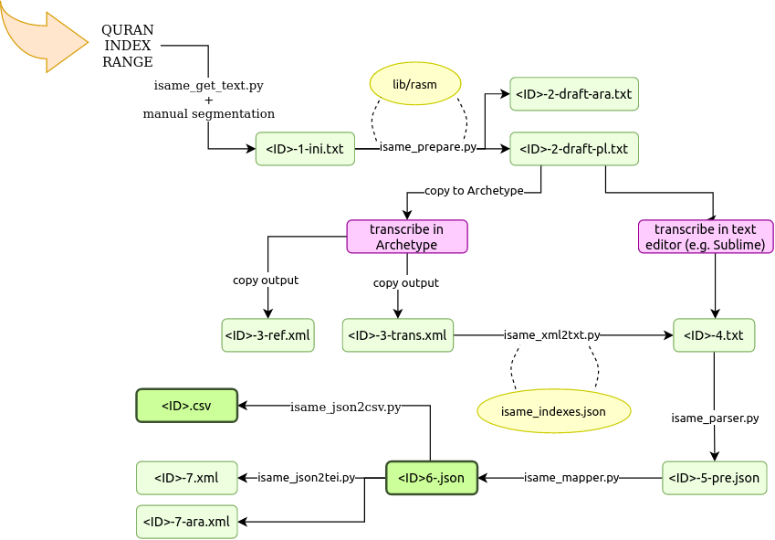

# The intertwined world of the oral and written transmission of sacred traditions in the Middle East - InterSaME

InterSaME – The intertwined world of the oral and written transmission of sacred traditions in the Middle East – is a DFG-AHRC joint project. Principal investigators are **Alba Fedeli** (Universität Hamburg) and **Geoffrey Khan** (University of Cambridge).

The code has been developed by **Alicia González Martínez** and **Carolin Kinne-Wall**.

Website: www.intersame.uni-hamburg.de

## Description

The purpose of this project is to bring together strands of research related to various aspects of the transmission of sacred texts in order reach a deeper understanding of the intertwined world of the three major religions of the Middle East at their formative periods of development during the early Islamic centuries. The Arabic Qur’an, the Syriac Bible and the Hebrew Bible, the sacred texts of Islam, Eastern Christianity and Judaism respectively, were all transmitted in oral and written form. The modes of transmission of these traditions converged to a remarkable degree in the medieval Middle East, reflecting close contact between the various religious communities.

The pipeline for data transformation of the project is the following:

